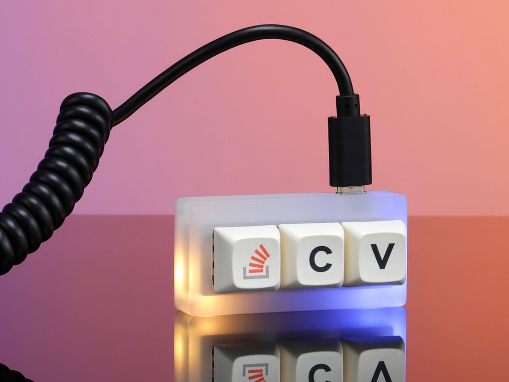

I used to joke that my job was just being able to navigate stackoverflow really good.
It was such a meme someone made a keyboard out of it. I actually own this keyboard!

Dramatization. I don't remember where I put mine

These days it's become about being really good at wrangling with AI. I actually use 
chatGPT so much these days. I'll admit, it certainly knows more about coding than I 
do. I don't think this a bad thing though, it's enabled me to create things a lot 
faster than I would have been able to previously.
