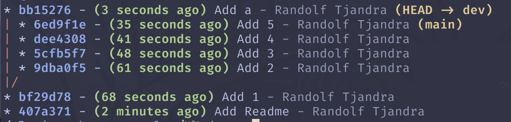
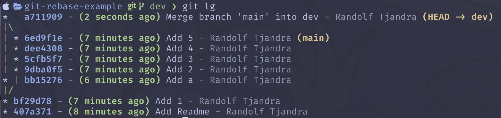
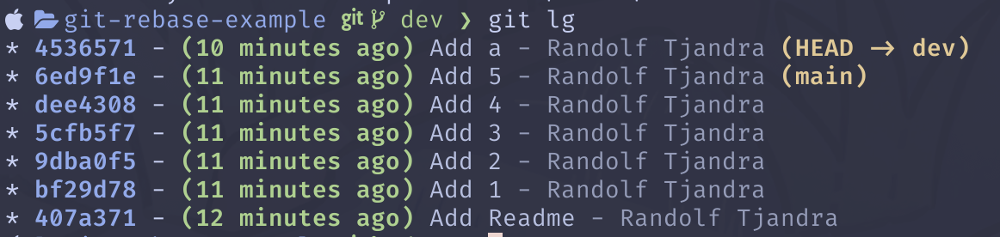

Inspired by a former mentor of mine, I set up this alias in my .gitconfig file.

```
lg = log --graph --abbrev-commit --decorate --date=relative --format=format:'%C(bold blue)%h%C(reset) - %C(bold green)(%ar)%C(reset) %C(white)%s%C(reset) %C(dim white)- %an%C(reset)%C(bold yellow)%d%C(reset)' --all
```


When you run this you see every commit on your project's git commit tree. You see every branch that belongs to you and every other contributor's branches on origin in a single view. For me this is a way to observe my team's work progress from a high level. It's a little nosy perhaps because it may not be my place to judge my peers' progress, but it's all on origin so I personally don't see the issue.

For example if I see someone who's building a branch that has far too many commits, I have to wonder if they're struggling to complete their work, or if the issue they're working on wasn't specified properly. Either there was too much work defined in a single issue, or its description wasn't written thoroughly enough. This is a good time to approach that contributor to see if there's anything they need to better complete their work.

More importantly through this view is how I protect the health of the main git branch. I want to see a single straight vertical line. Each commit on the line should contain a single succinct line describing its contents. I do not want to see any merge commits in main. I don't even want to see any merge commits in people's branches.

To avoid using merge commits from main onto my development branches I always rebase origin/main. The idea is that my work should be built on top of main exactly where I intend to merge it. I want to keep my pull requests pure in the sense that they contain commits that I created for my branch.

I've heard from a few developers that rebase is difficult to handle because of the potential conflicts they'll have to resolve for each of the commits on their branch. Here's the thing though: your branch is ultimately going to be squashed into a single commit when it's merged onto main. Why not do that right now as you're developing? Combine all your work up until this point into a single commit, then rebase origin/main. If there are any conflicts you have to resolve, you only have to resolve them once.

## Example
This is a very simple example but I hope it illustrates what I'm trying convey.

At this point of my development I realize that main has moved ahead.



I can either merge all the changes that have been made on main so far into my branch..



Or I can rebase main, essentially saying that all of my changes have been built on top the latest changes to main



To me conceptually it's easier to grasp, especially on long lived branches, what exactly the relationship between my branch and origin/main is. 
It's always simple when you rebase: my branch contains only things that I have written and I intend to merge onto origin/main. With a merge commit you're saying: My branch contains a mixed chronology of commits I wrote and other people wrote.

I hope that makes sense.
